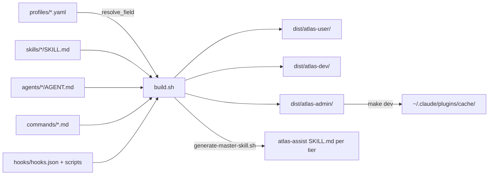
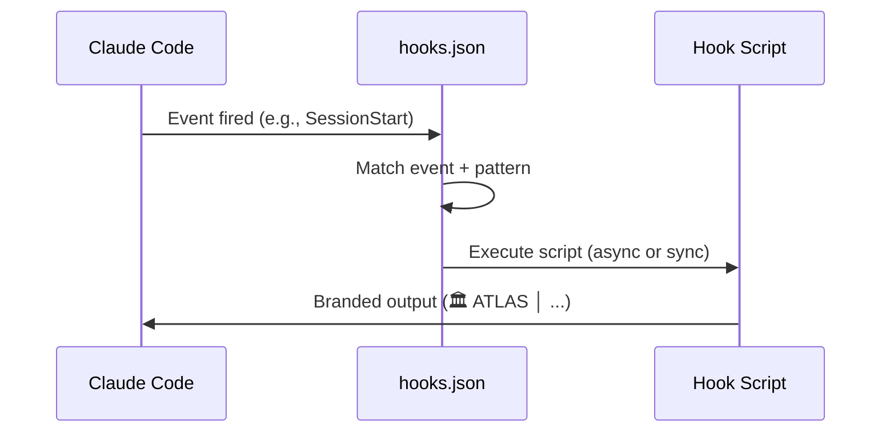

# ATLAS Plugin Architecture

> Deep dive into the build system, tier inheritance, CI/CD, and hook lifecycle.
> For quick reference, see `CLAUDE.md`. This doc covers the WHY and HOW.

---

## Build Pipeline



### Build steps (`build.sh`)

1. **Read VERSION** → propagate to all JSON manifests
2. **For each tier** (admin, dev, user):
   - `resolve_field()` walks YAML inheritance chain recursively
   - Copy resolved skills, refs, commands, agents
   - Copy ALL hooks (wildcard — all tiers get all hooks)
   - Copy runtime scripts (explicit list, not wildcard)
   - Copy VERSION + config presets
   - **Generate atlas-assist** via `generate-master-skill.sh` (dynamic counts, tier persona)
   - Generate `plugin.json` + `marketplace.json`
3. **Output** → `dist/atlas-{tier}/` (self-contained, no runtime deps)

### `resolve_field()` — Recursive Inheritance

```bash
resolve_field(tier, field):
  parent = profiles/{tier}.yaml → .inherits
  if parent exists:
    items = resolve_field(parent, field)  # recurse
  items += profiles/{tier}.yaml → .{field}[]
  return deduplicated(items)
```

**Example**: `resolve_field("admin", "skills")` →
1. Resolves `user.yaml` skills (14 items)
2. Appends `dev.yaml` skills (16 items)
3. Appends `admin.yaml` skills (13 items)
4. Deduplicates → 43 skills + atlas-assist (generated)

---

## Tier Architecture

```
┌─────────────────────────────────────────────────┐
│                    ADMIN                         │
│  statusline-setup, devops-deploy, experiment-    │
│  loop, infrastructure-ops, security-audit,       │
│  feature-board, code-analysis, enterprise-audit, │
│  knowledge-manager, platform-update, atlas-dev-  │
│  self, atlas-vault, plan-review                  │
│  Persona: infrastructure architect               │
│  Pipeline: DISCOVER→PLAN→IMPLEMENT→VERIFY→       │
│            SHIP→DEPLOY→INFRA                     │
├─────────────────────────────────────────────────┤
│                     DEV                          │
│  tdd, executing-plans, subagent-dispatch, git-   │
│  worktrees, frontend-design, systematic-debug,   │
│  verification, code-review, code-simplify,       │
│  finishing-branch, plan-builder, brainstorming,   │
│  decision-log, session-retro, hookify, skill-    │
│  management, plugin-builder, engineering-ops      │
│  + 5 agents, 3 refs                              │
│  Persona: senior engineering architect            │
├─────────────────────────────────────────────────┤
│                     USER                         │
│  note-capture, morning-brief, knowledge-builder, │
│  user-profiler, reminder-scheduler, deep-        │
│  research, document-generator, context-discovery,│
│  scope-check, browser-automation, atlas-onboard, │
│  atlas-doctor, atlas-location, youtube-transcript │
│  + 1 agent, 2 refs                               │
│  Persona: helpful assistant                       │
└─────────────────────────────────────────────────┘
```

| Tier | Skills | Commands | Agents | Refs | Persona |
|------|--------|----------|--------|------|---------|
| user | 14 | 14 | 1 | 2 | helpful assistant |
| dev | 30 | 31 | 6 | 5 | senior engineering architect |
| admin | 43 | 44 | 6 | 5 | infrastructure architect |

*+atlas-assist (generated) in each tier = +1 skill/command*

---

## generate-master-skill.sh

Dynamically builds `atlas-assist/SKILL.md` per tier:

1. Calls `resolve_field()` to get tier's full skill/agent/command lists
2. Reads `EMOJI_MAP`, `DESC_MAP`, `CATEGORY_MAP` (hardcoded in script)
3. Generates:
   - Session start banner with version + tier + counts
   - Persona header format with breadcrumbs
   - Response footer format (Recap / Next Steps / Recommendation)
   - Skill listing grouped by category with emoji + description
   - Pipeline definition per tier
   - Model strategy table
   - Non-negotiable principles

**When adding a skill**: Must update `EMOJI_MAP`, `DESC_MAP`, `CATEGORY_MAP` in this script.

---

## CI/CD Pipeline

```
.forgejo/workflows/
├── ci.yaml        # On push/PR: test suite
└── publish.yaml   # On tag: build + publish
```

### CI (`ci.yaml`)
- Trigger: push to any branch, PR to `main`
- Steps: checkout → Python setup → `make test`

### Publish (`publish.yaml`)
- Trigger: version tag (`v*`)
- Steps: checkout → build all → create Forgejo Release with assets

### Dev Workflow
```bash
make dev          # build admin + install to CC cache (quick iteration)
make test         # full test suite (16 test files)
make lint         # structural checks only
make publish-patch  # bump patch → build → test → tag → push → release
make publish-minor  # bump minor version
```

---

## Hook Lifecycle



### Hook Registry (`hooks/hooks.json`)

| Event | Hook | Async | Purpose |
|-------|------|-------|---------|
| SessionStart | atlas-session-start | yes | Banner, first-run detection, env check |
| UserPromptSubmit | atlas-prompt-gate | yes | Timestamp injection, context hints |
| PostToolUse | atlas-post-tool | yes | Visual QA gate, scope alerts |

**Key rules**:
- All hooks are copied to ALL tiers (wildcard copy)
- Hook scripts MUST be executable (`chmod +x`)
- Branded output: `🏛️ ATLAS │ {emoji}{severity} {CATEGORY} │ {message}`
- Async hooks: max 5s, exit 0 on error (non-blocking)

---

## Directory Structure

```
atlas-dev-plugin/
├── .blueprint/              # Architecture docs (this directory)
│   ├── INDEX.md
│   ├── VISION.md
│   ├── ARCHITECTURE.md      ← YOU ARE HERE
│   └── plans/
├── .claude/rules/           # AI behavior rules (4+ files)
├── .claude-plugin/          # Source plugin.json + marketplace.json
├── .forgejo/workflows/      # CI/CD (ci.yaml, publish.yaml)
├── agents/                  # 6 agent definitions (AGENT.md each)
├── commands/                # 45 command routing files (.md)
├── hooks/                   # hooks.json + executable scripts
├── profiles/                # 3 YAML tier definitions
├── scripts/                 # Build + runtime scripts
│   ├── build.sh → ../build.sh
│   ├── generate-master-skill.sh
│   ├── publish.sh
│   ├── dev-install.sh
│   └── presets/             # Config presets (JSON)
├── skills/                  # 48 skill directories
│   ├── {skill-name}/SKILL.md
│   └── refs/                # 5 reference skills
├── tests/                   # 16 pytest files
├── build.sh                 # Main builder
├── Makefile                 # Dev workflow shortcuts
├── VERSION                  # Semver SSoT
├── CLAUDE.md                # AI context (< 200 lines)
├── README.md                # Human readme
├── PARALLELISM.md           # Parallelism safety guide
└── CHANGELOG.md             # Version history
```

---

*Updated: 2026-03-22 | Maintain when: build system or CI/CD changes*
