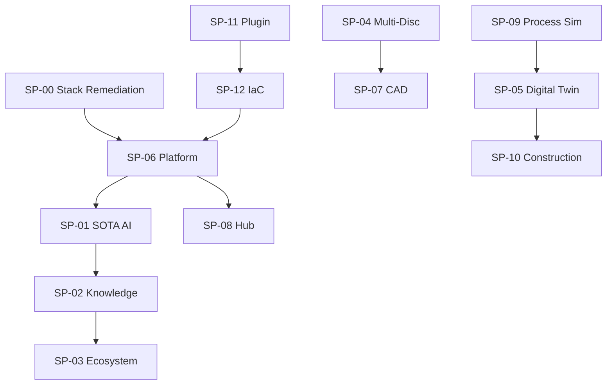
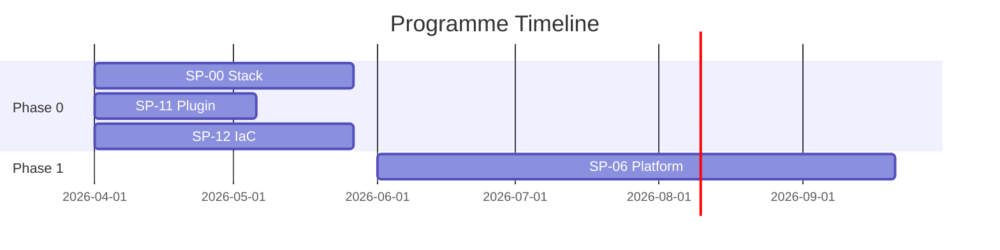

# {Programme Name} — Mega Plan {YYYY-YYYY}

> **Programme ID**: {PROG-NNN}
> **Total Effort**: {hours}h
> **Sub-Plans**: {count}
> **Phases**: {count}
> **HITL Gates**: {count}
> **Quality Score**: _/17 (gate: >=10/17)
> **Status**: PLANNING | IN_PROGRESS | VALIDATED | SHIPPED
> **Owner**: {name}
> **Updated**: {YYYY-MM-DD}

---

## M1 — Programme Vision

**Mission**: {one-sentence programme mission}

**Problem**: {what pain does this programme solve?}

**Business Value**: {revenue, cost savings, competitive advantage}

**Personas Impacted**: {list with impact level: TRES HAUT, HAUT, MOYEN}

**Success Criteria**: {3-5 measurable outcomes}

---

## M2 — Sub-Plan Registry

| ID | Title | Effort | Phase | Status | Owner | Dependencies | Quality |
|----|-------|--------|-------|--------|-------|-------------|---------|
| SP-{NN} | {title} | {hours}h | P{N} | {status} | {owner} | {SP-NN list} | {score}/15 |

**Total**: {sum}h across {count} sub-plans

**Coverage check**: Every sub-plan MUST have an entry. Orphan sub-plans = planning gap.

---

## M3 — Dependency Graph



**DAG Validation Rules**:
- No cycles (topological sort must succeed)
- Every SP in M2 appears in graph
- Critical path highlighted (longest weighted path)

**ASCII fallback** (for CLI rendering):
```
SP-11 -> SP-12 -> SP-06 -> SP-01 -> SP-02 -> SP-03
                    |        |
                  SP-08    (parallel)
SP-04 -> SP-07
SP-09 -> SP-05 -> SP-10
```

---

## M4 — Integration Points

| IP | Name | Sub-Plans | Shared Resources | Risk | Status |
|----|------|-----------|-----------------|------|--------|
| IP-{N} | {name} | {SP-NN, SP-NN} | {tables, APIs, schemas} | {HAUT/MOYEN/BAS} | {status} |

**Validation**: Every IP must have:
- Clear data contract (schema or API spec)
- Owner responsible for integration testing
- Rollback plan if integration fails

---

## M5 — Phase Timeline

| Phase | Name | Sub-Plans | Effort | Quarter | Prereqs | Gate |
|-------|------|-----------|--------|---------|---------|------|
| P0 | Tooling | SP-00, SP-11, SP-12 | {h}h | Q2 2026 | None | G1 |
| P1 | Platform | SP-06, SP-08 | {h}h | Q2-Q3 | P0 | G2 |
| P2 | AI | SP-01 | {h}h | Q3-Q4 | P1 | G3 |
| P3 | Knowledge + Disciplines | SP-02, SP-04 | {h}h | Q3-Q4 | P1 | G4 |
| P4 | Outputs | SP-07, SP-09 | {h}h | Q4 | P3 | G5 |
| P5 | Operations | SP-05, SP-10 | {h}h | 2027 | P3, P4 | G6 |
| P6 | Capstone | SP-03 | {h}h | 2027 | P2, P3 | G7 |

**Gantt** (Mermaid):


---

## M6 — Critical Path

**Longest path**: SP-11 -> SP-12 -> SP-06 -> SP-01 -> SP-02 -> SP-03

**Duration**: {total weeks}

**Buffer**: {weeks} slack between phases

**Bottleneck**: {SP-NN — why it's the bottleneck}

---

## M7 — Resource Allocation

| Phase | Backend | Frontend | Infra | AI/ML | Total |
|-------|---------|----------|-------|-------|-------|
| P0 | {h}h | — | {h}h | — | {h}h |
| P1 | {h}h | {h}h | {h}h | — | {h}h |

**Capacity**: {hours/week available}

**Constraint**: Single developer (Seb) — serial execution on critical path

---

## M8 — Risk Matrix

| Risk | Probability | Impact | Mitigation | Owner |
|------|------------|--------|------------|-------|
| {description} | {H/M/L} | {H/M/L} | {action} | {name} |

---

## M9 — Governance

| Gate | Phase | Criteria | Approver | Status |
|------|-------|----------|----------|--------|
| G1 Design | P0 done | All P0 sub-plans >=12/15 | {name} | -- |
| G2 Platform | P1 done | Auth + Hub deployed + E2E | {name} | -- |

**Escalation**: If a phase is >20% over budget -> HITL review before continuing.

---

## M10 — Budget

| Category | Hours | Rate | Cost |
|----------|-------|------|------|
| Development | {h}h | — | Internal |
| Infrastructure | — | — | ${amount}/mo |
| Subventions | — | — | -${amount} |
| **Total** | {h}h | — | ${net} |

---

## M11 — Stakeholders (RACI)

| Stakeholder | Role | R | A | C | I |
|------------|------|---|---|---|---|
| {name} | {role} | {x} | {x} | | |

---

## M12 — Quality Gates

**Dual Gate System**:
1. **Programme gate**: >=10/17 on M1-M17 criteria
2. **Sub-plan gate**: ALL sub-plans >=12/15 on A-O criteria

| # | Criterion | Score |
|---|-----------|-------|
| 1 | M1 Vision clear + measurable | _/1 |
| 2 | M2 Registry complete (all SPs listed) | _/1 |
| 3 | M3 DAG valid (no cycles, complete) | _/1 |
| 4 | M4 Integration points documented | _/1 |
| 5 | M5 Phase timeline realistic | _/1 |
| 6 | M6 Critical path identified | _/1 |
| 7 | M7 Resource allocation feasible | _/1 |
| 8 | M8 Risk matrix populated | _/1 |
| 9 | M9 Governance gates defined | _/1 |
| 10 | M10 Budget estimated | _/1 |
| 11 | M11 RACI assigned | _/1 |
| 12 | M13 Rollout phases defined | _/1 |
| 13 | M14 Compliance + audit trail documented | _/1 |
| 14 | M15 Runbooks per phase | _/1 |
| 15 | M16 Monitoring + observability defined | _/1 |
| 16 | Bidirectional links (mega <-> sub) verified | _/1 |
| 17 | Phase effort sums match total + no orphan SPs | _/1 |

**Score**: _/17 | **Gate**: >=10/17

---

## M13 — Rollout Phases

Define how each programme phase ships to users (staging, pilot, GA).

| Phase | Sub-Plans | Rollout Stage | Target Env | User Group | Entry Criteria | Exit Criteria |
|-------|-----------|--------------|------------|------------|----------------|---------------|
| P{N} | {SP-NN list} | STAGING | dev/staging | Dev team | All unit tests pass | E2E green on staging |
| P{N} | {SP-NN list} | PILOT | staging/prod | Power users | Staging validated | 48h zero-critical in pilot |
| P{N} | {SP-NN list} | GA | production | All users | Pilot approved | Monitoring stable 7 days |

**Rollout Checklist** (per phase):
- [ ] Feature flags configured (off by default)
- [ ] Staging deployment verified (`/atlas verify`)
- [ ] HITL gate approval obtained (Gate G{N})
- [ ] Pilot group identified and notified
- [ ] Rollback procedure tested
- [ ] Monitoring dashboards configured (see M16)
- [ ] GA announcement prepared

**Rollback trigger**: Any P0/P1 incident within 48h of GA → auto-rollback to previous phase.

---

## M14 — Compliance & Audit Trail

Document regulatory, quality, and HITL gate requirements per sub-plan.

| Standard | Requirement | Sub-Plans | HITL Gate | Evidence | Status |
|----------|------------|-----------|-----------|----------|--------|
| {standard} | {requirement} | {SP-NN list} | G{N} | {doc/test/log} | -- |

**HITL Gates Documentation**:

| Gate | Phase | Approver | Criteria | Artifact |
|------|-------|----------|----------|----------|
| G{N} | P{N} | {name} | {criteria list} | `MEGA-STATUS.jsonl` entry + commit SHA |

**Audit Trail Checklist**:
- [ ] Every sub-plan phase completion logged to `MEGA-STATUS.jsonl`
- [ ] Git commit SHA recorded with each gate approval
- [ ] Decision rationale captured in `.claude/decisions.jsonl`
- [ ] Quality score snapshots preserved (before/after)
- [ ] Rollback events documented with root cause

---

## M15 — Support & Runbooks

Operational runbooks for each programme phase (what to do when things break).

| Phase | Runbook | Trigger | Steps | Owner |
|-------|---------|---------|-------|-------|
| P{N} | {runbook name} | {condition} | {action summary} | {name} |

**Standard Runbook Template** (per phase):
```
RUNBOOK: {Phase Name} — {failure scenario}
TRIGGER: {what triggers this runbook}
SEVERITY: P0 (outage) | P1 (degraded) | P2 (minor)
STEPS:
  1. {immediate action}
  2. {diagnostic command}
  3. {fix or rollback}
  4. {verify recovery}
ESCALATION: {who to contact if steps fail}
POST-MORTEM: {where to log the incident}
```

**Support Checklist**:
- [ ] Runbook exists for each phase's critical path
- [ ] On-call contact defined per active phase
- [ ] Rollback script tested for each deployment
- [ ] Incident response channel established
- [ ] Post-mortem template linked

---

## M16 — Monitoring & Observability

Metrics, dashboards, and alerts per programme phase.

| Phase | Metric | Target | Dashboard | Alert Threshold |
|-------|--------|--------|-----------|-----------------|
| P{N} | {metric name} | {target value} | {dashboard link} | {alert condition} |

**Core Programme Metrics**:

| Metric | Source | Formula | Cadence |
|--------|--------|---------|---------|
| Programme progress | `MEGA-STATUS.jsonl` | `sum(sp_pct * sp_effort) / sum(sp_effort)` | Per session |
| Phase velocity | `MEGA-STATUS.jsonl` | `effort_done_h / calendar_days` | Weekly |
| Quality drift | Sub-plan scores | `current_score - baseline_score` | Per review |
| Blocker count | Dependency graph | Count of BLOCKED sub-plans | Per session |
| HITL gate pass rate | Gate log | `gates_passed / gates_attempted` | Per phase |

**Alert Rules**:
- [ ] Phase >20% over effort budget → HITL review
- [ ] Sub-plan quality drops below 10/15 → mandatory review
- [ ] Critical path sub-plan blocked >3 days → escalation
- [ ] Programme velocity <50% of plan → re-plan trigger

**Observability Stack**:
- Progress: `/atlas programme status` (CLI dashboard)
- History: `MEGA-STATUS.jsonl` (append-only log)
- Decisions: `.claude/decisions.jsonl` (architectural choices)
- Health: `/atlas verify` (quality gates)

---

## M17 — Appendices

### Glossary
| Term | Definition |
|------|-----------|
| SP | Sub-Plan |
| IP | Integration Point |
| HITL | Human-In-The-Loop |
| DAG | Directed Acyclic Graph |
| DoD | Definition of Done |
| GA | General Availability |

### References
- Feature registry: `.blueprint/FEATURES.md`
- Sub-plans: `.blueprint/plans/sp*.md`
- Plan index: `.blueprint/plans/INDEX.md`
- Quality gate: `.blueprint/DEFINITION-OF-DONE.md`
- Mega status script: `scripts/mega-status-manager.sh`

### Changelog
| Date | Change | Author |
|------|--------|--------|
| {date} | Initial creation | {name} |
