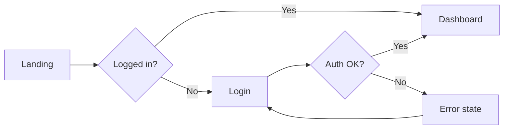

<red-flags>
| Thought | Reality |
|---|---|
| "Happy path only, handle edges later" | Edge paths are 40% of user hits. Design them upfront. |
| "Flow is obvious, skip the diagram" | Obvious to you ≠ obvious to dev/QA/onboarding. Diagram = shared truth. |
| "One flow per feature" | Some features have 3-5 flows (create/edit/delete/share/restore). Map each. |
</red-flags>

# Workflow: User Flow

## Output example



## Success output

```json
{
  "workflow": "user-flow",
  "status": "completed",
  "mermaid_diagram": "...",
  "screens_mapped": N,
  "edge_cases_covered": M,
  "hitl_approved": true
}
```
