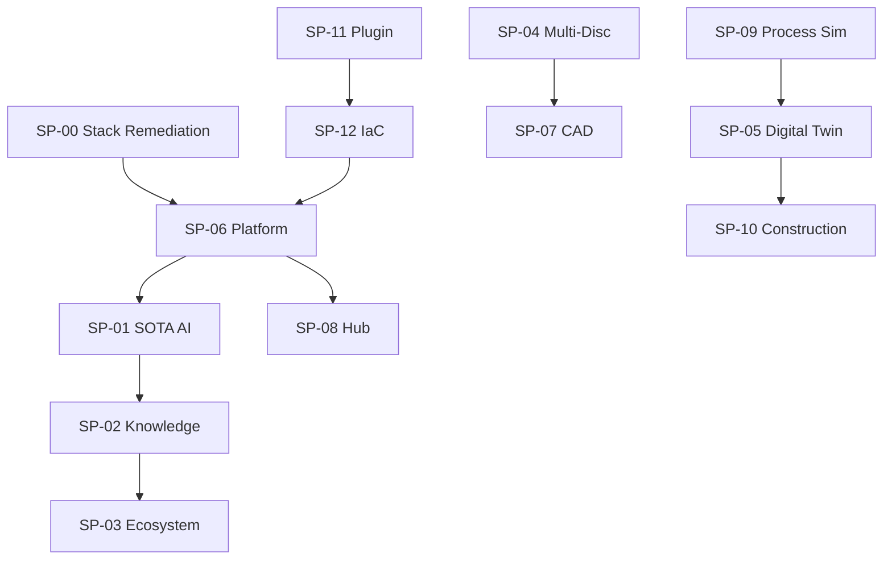
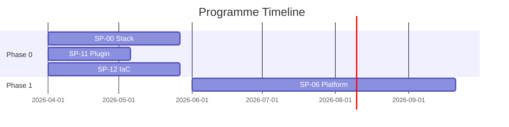

# {Programme Name} — Mega Plan {YYYY-YYYY}

> **Programme ID**: {PROG-NNN}
> **Total Effort**: {hours}h
> **Sub-Plans**: {count}
> **Phases**: {count}
> **HITL Gates**: {count}
> **Quality Score**: _/16 (gate: >=10/16)
> **Status**: PLANNING | IN_PROGRESS | VALIDATED | SHIPPED
> **Owner**: {name}
> **Updated**: {YYYY-MM-DD}

---

## M1 — Programme Vision

**Mission**: {one-sentence programme mission}

**Problem**: {what pain does this programme solve?}

**Business Value**: {revenue, cost savings, competitive advantage}

**Personas Impacted**: {list with impact level: TRES HAUT, HAUT, MOYEN}

**Success Criteria**: {3-5 measurable outcomes}

---

## M2 — Sub-Plan Registry

| ID | Title | Effort | Phase | Status | Owner | Dependencies | Quality |
|----|-------|--------|-------|--------|-------|-------------|---------|
| SP-{NN} | {title} | {hours}h | P{N} | {status} | {owner} | {SP-NN list} | {score}/15 |

**Total**: {sum}h across {count} sub-plans

**Coverage check**: Every sub-plan MUST have an entry. Orphan sub-plans = planning gap.

---

## M3 — Dependency Graph



**DAG Validation Rules**:
- No cycles (topological sort must succeed)
- Every SP in M2 appears in graph
- Critical path highlighted (longest weighted path)

**ASCII fallback** (for CLI rendering):
```
SP-11 -> SP-12 -> SP-06 -> SP-01 -> SP-02 -> SP-03
                    |        |
                  SP-08    (parallel)
SP-04 -> SP-07
SP-09 -> SP-05 -> SP-10
```

---

## M4 — Integration Points

| IP | Name | Sub-Plans | Shared Resources | Risk | Status |
|----|------|-----------|-----------------|------|--------|
| IP-{N} | {name} | {SP-NN, SP-NN} | {tables, APIs, schemas} | {HAUT/MOYEN/BAS} | {status} |

**Validation**: Every IP must have:
- Clear data contract (schema or API spec)
- Owner responsible for integration testing
- Rollback plan if integration fails

---

## M5 — Phase Timeline

| Phase | Name | Sub-Plans | Effort | Quarter | Prereqs | Gate |
|-------|------|-----------|--------|---------|---------|------|
| P0 | Tooling | SP-00, SP-11, SP-12 | {h}h | Q2 2026 | None | G1 |
| P1 | Platform | SP-06, SP-08 | {h}h | Q2-Q3 | P0 | G2 |
| P2 | AI | SP-01 | {h}h | Q3-Q4 | P1 | G3 |
| P3 | Knowledge + Disciplines | SP-02, SP-04 | {h}h | Q3-Q4 | P1 | G4 |
| P4 | Outputs | SP-07, SP-09 | {h}h | Q4 | P3 | G5 |
| P5 | Operations | SP-05, SP-10 | {h}h | 2027 | P3, P4 | G6 |
| P6 | Capstone | SP-03 | {h}h | 2027 | P2, P3 | G7 |

**Gantt** (Mermaid):


---

## M6 — Critical Path

**Longest path**: SP-11 -> SP-12 -> SP-06 -> SP-01 -> SP-02 -> SP-03

**Duration**: {total weeks}

**Buffer**: {weeks} slack between phases

**Bottleneck**: {SP-NN — why it's the bottleneck}

---

## M7 — Resource Allocation

| Phase | Backend | Frontend | Infra | AI/ML | Total |
|-------|---------|----------|-------|-------|-------|
| P0 | {h}h | — | {h}h | — | {h}h |
| P1 | {h}h | {h}h | {h}h | — | {h}h |

**Capacity**: {hours/week available}

**Constraint**: Single developer (Seb) — serial execution on critical path

---

## M8 — Risk Matrix

| Risk | Probability | Impact | Mitigation | Owner |
|------|------------|--------|------------|-------|
| {description} | {H/M/L} | {H/M/L} | {action} | {name} |

---

## M9 — Governance

| Gate | Phase | Criteria | Approver | Status |
|------|-------|----------|----------|--------|
| G1 Design | P0 done | All P0 sub-plans >=12/15 | {name} | -- |
| G2 Platform | P1 done | Auth + Hub deployed + E2E | {name} | -- |

**Escalation**: If a phase is >20% over budget -> HITL review before continuing.

---

## M10 — Budget

| Category | Hours | Rate | Cost |
|----------|-------|------|------|
| Development | {h}h | — | Internal |
| Infrastructure | — | — | ${amount}/mo |
| Subventions | — | — | -${amount} |
| **Total** | {h}h | — | ${net} |

---

## M11 — Stakeholders (RACI)

| Stakeholder | Role | R | A | C | I |
|------------|------|---|---|---|---|
| {name} | {role} | {x} | {x} | | |

---

## M12 — Quality Gates

**Dual Gate System**:
1. **Programme gate**: >=10/16 on M1-M16 criteria
2. **Sub-plan gate**: ALL sub-plans >=12/15 on A-O criteria

| # | Criterion | Score |
|---|-----------|-------|
| 1 | M1 Vision clear + measurable | _/1 |
| 2 | M2 Registry complete (all SPs listed) | _/1 |
| 3 | M3 DAG valid (no cycles, complete) | _/1 |
| 4 | M4 Integration points documented | _/1 |
| 5 | M5 Phase timeline realistic | _/1 |
| 6 | M6 Critical path identified | _/1 |
| 7 | M7 Resource allocation feasible | _/1 |
| 8 | M8 Risk matrix populated | _/1 |
| 9 | M9 Governance gates defined | _/1 |
| 10 | M10 Budget estimated | _/1 |
| 11 | M11 RACI assigned | _/1 |
| 12 | M14 Rollout phases defined | _/1 |
| 13 | M15 Compliance requirements listed | _/1 |
| 14 | Bidirectional links (mega <-> sub) verified | _/1 |
| 15 | Phase effort sums match total | _/1 |
| 16 | No orphan sub-plans | _/1 |

**Score**: _/16 | **Gate**: >=10/16

---

## M13 — Communication

| Cadence | What | Where | Who |
|---------|------|-------|-----|
| Weekly | Sprint progress | /atlas programme | Dev team |
| Bi-weekly | Phase status | MEGA-STATUS.jsonl | Stakeholders |
| Monthly | Programme review | Meeting + report | All |

---

## M14 — Rollout Strategy

| Phase | When | Scope | Gate |
|-------|------|-------|------|
| PILOT | {quarter} | {scope} | {criteria} |
| EXPAND | {quarter} | {scope} | {criteria} |
| GA | {quarter} | {scope} | {criteria} |

---

## M15 — Compliance

| Standard | Requirement | Sub-Plans | Status |
|----------|------------|-----------|--------|
| ISO 15489 | Document management | SP-02, SP-07 | -- |
| ISA 5.1 | Instrument symbols | SP-07 | -- |
| OWASP Top 10 | Security baseline | SP-06 | -- |

---

## M16 — Appendices

### Glossary
| Term | Definition |
|------|-----------|
| SP | Sub-Plan |
| IP | Integration Point |
| HITL | Human-In-The-Loop |

### References
- Feature registry: `.blueprint/FEATURES.md`
- Sub-plans: `.blueprint/plans/sp*.md`
- Plan index: `.blueprint/plans/INDEX.md`

### Changelog
| Date | Change | Author |
|------|--------|--------|
| {date} | Initial creation | {name} |
