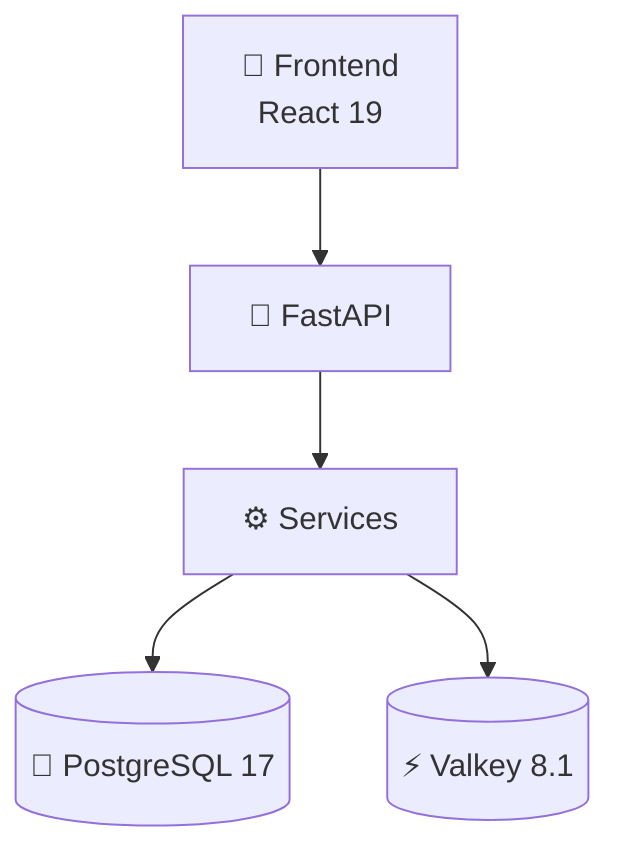
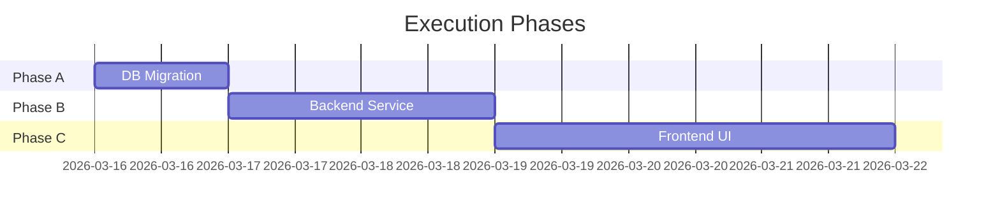
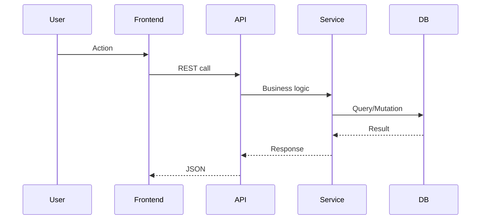

# Plan Builder

## Overview

Generate comprehensive engineering plans with 15 sections covering technical + enterprise + execution concerns. Every plan is a complete engineering document, not a TDD checklist.

**Model**: ALWAYS Opus 4.6 with maximum thinking effort. Plans are architecture decisions.
**Output**: Maximum tokens. Never truncate a plan to save tokens.

**Announce:** "Building engineering plan using Atlas Dev plan-builder..."

## Pre-Requisites

1. **Context Discovery** must have run (or run it now)
2. **Existing plans checked**: Read `.blueprint/plans/INDEX.md`
   - If plan exists for this subsystem → EXTEND, not replace
   - If no plan → create from template

## Workflow

### Step 1: Load Context
- Read context discovery report
- Read `.blueprint/plans/INDEX.md` → check for existing plan
- If extending: read existing plan fully
- Read project's plan template (`.blueprint/PLAN-TEMPLATE.md` if exists, else use built-in)

### Step 2: Research
- WebSearch for current (2026+) best practices related to the feature
- Context7 for library-specific documentation
- Document findings for architecture decisions (Section C)

### Step 3: Brainstorm with User
- If architecture decisions needed: AskUserQuestion with 2-3 approaches
- Include comparison table (pros/cons/recommendation)
- Get user validation BEFORE drafting

### Step 4: Draft Plan
Fill all 15 sections in order:

**Core (A-G):**
- A. VISION — Why this change? Problem + solution + personas + business value
- B. INVENTAIRE — Current state: files, tables, configs, hooks to reuse
- C. ARCHITECTURE — ASCII diagram + decisions with sources (Context7/WebSearch)
- D. DB SCHEMA — Full CREATE TABLE/ALTER TABLE with indexes
- E. BACKEND — Service classes with method signatures + before/after
- F. API — Endpoints table: method, path, auth, request, response
- G. FRONTEND UX — ASCII mockup + components + hooks + UX convergence checklist

**Enterprise (H-L):**
- H. PERSONA IMPACT — Matrix: persona x impact x capability x UX x RBAC x test
- I. SECURITY & ACCESS — RBAC table + OWASP checklist + data sensitivity
- J. AI-NATIVE & OBSERVABILITY — API for AI + logging + metrics + health
- K. INFRASTRUCTURE & PERF — Hardware table + perf targets + cache + scaling
- L. REUSABILITY & MULTI-TENANT — Multi-company + multi-discipline + config points

**Execution (M-O):**
- M. TRACEABILITY & AUDIT — Audit trail + versioning + derivation tracking
- N. PHASES — Table: phase, content, files, duration, dependencies
- O. VERIFICATION — Backend + frontend + E2E persona + DB + perf + security

If a section is not applicable → write "N/A — {1-line justification}"

### Step 5: Quality Gate
Score the plan against 15 criteria:

| # | Criteria | Points |
|---|---------|--------|
| 1 | Vision explains WHY + engineering chain impact | 0-1 |
| 2 | Inventory lists code/data + reusable hooks | 0-1 |
| 3 | Architecture has ASCII diagram + sourced decisions | 0-1 |
| 4 | Full-stack sections D+E+F+G present | 0-1 |
| 5 | Personas with test scenarios | 0-1 |
| 6 | UX convergent (references ux-rules) | 0-1 |
| 7 | Research done (Context7/WebSearch) | 0-1 |
| 8 | Security + RBAC covered | 0-1 |
| 9 | AI-native described | 0-1 |
| 10 | Infrastructure + perf targets | 0-1 |
| 11 | Reusability explained | 0-1 |
| 12 | Traceability + audit trail | 0-1 |
| 13 | Phases with files listed | 0-1 |
| 14 | E2E verification with commands | 0-1 |
| 15 | Patterns reused (references existing code) | 0-1 |

**Gate: score >= 12/15**
If score < 12: identify weak sections → enrich → re-score (max 2 iterations)

### Step 6: Save & Present
- Save to `.blueprint/plans/{subsystem}.md`
- Update `.blueprint/plans/INDEX.md`
- Present plan to user with quality score
- Wait for approval: "go" = implement, "change X" = iterate

## Visual Output Standards

Every plan MUST include:
- 📊 ASCII architecture diagram (Section C)
- 🖥️ ASCII UI mockup (Section G) — if frontend changes
- 📋 Comparison tables for decisions (Section C)
- 📈 Persona impact matrix (Section H)
- ✅ Quality score breakdown at the end
- Emojis for scannability (section headers, status indicators)

## Plan Types

| Section | Feature | Refactor | Bugfix |
|---------|---------|----------|--------|
| A-B | FULL | FULL | FULL (root cause) |
| C | FULL | LITE (diff) | N/A |
| D-F | IF applicable | IF applicable | N/A |
| G | FULL | LITE | IF applicable |
| H | FULL | LITE | LITE |
| I-L | FULL | LITE | N/A (except security) |
| M | FULL | LITE | FULL |
| N-O | FULL | FULL | FULL |

## Commit Convention

After plan is saved:
```
plan({subsystem}): {description}
```
Example: `plan(rule-engine): add AI auto-tune workflow`

## Diagram & Visual Format

### Mermaid Diagrams (PREFERRED over ASCII)

Plans render in the Atlas Dev dashboard via MarkdownRenderer which supports Mermaid v11.
Use Mermaid for ALL architecture and flow diagrams:

**Architecture (Section C)**:
````markdown

````

**Execution Phases (Section N)**:
````markdown

````

**Data Flow / Sequence**:
````markdown

````

### Tables (GFM markdown)
All comparisons, inventories, and matrices → markdown tables with `|` borders.
MarkdownRenderer styles them with Synapse theme automatically.

### Emojis in Section Headers
Use emojis for scannability:
- `## 🔍 A. VISION`
- `## 📦 B. INVENTAIRE`
- `## 🏗️ C. ARCHITECTURE`
- `## 💾 D. DB SCHEMA`
- `## ⚙️ E. BACKEND`
- `## 🔌 F. API`
- `## 🖥️ G. FRONTEND UX`
- `## 🎭 H. PERSONA IMPACT`
- `## 🔒 I. SECURITY`
- `## 🤖 J. AI-NATIVE`
- `## 🖥️ K. INFRASTRUCTURE`
- `## ♻️ L. REUSABILITY`
- `## 📋 M. TRACEABILITY`
- `## 📅 N. PHASES`
- `## ✅ O. VERIFICATION`

## Extending Existing Plans

When extending (not creating new):
1. Load full existing plan
2. Identify sections to update
3. Add new content to relevant sections
4. Keep untouched sections intact
5. Re-score the extended plan
6. Git diff shows only changed sections
